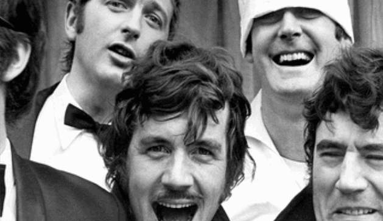

famous-kenburnscontainer
==========

Famo.us view for performing ken-burns style zooming and panning.

The view uses a ContainerSurface to embed the renderable in and support clipping.



## Demo

[View the demo here](https://rawgit.com/IjzerenHein/famous-kenburnscontainer/master/examples/demo/index.html)

## Installation

Install using bower:

	bower install ijzerenhein/famous-kenburnscontainer

## Getting started

If necessary, add to the requirejs paths config:

```javascript
require.config({
    paths: {
        ...
        'famous-kenburnscontainer': 'bower_components/famous-kenburnscontainer/KenBurnsContainer',
        ...
    }
});
```

Example of how to create a KenBurnsContainer:

```javascript
var KenBurnsContainer = require('famous-kenburnscontainer');

// create container
var kenBurnsContainer = new KenBurnsContainer();
this.add(kenBurnsContainer);

// add child content
var photo = new ImageSurface({
    content: 'image.png'
});
kenBurnsContainer.add(photo);

// create sequence of pan & zoom animations
kenBurnsContainer.panAndZoom([0.0, 0.05], 1.9); // move to left-top & zoom-in
kenBurnsContainer.delay();                      // wait a bit (use default delay)
kenBurnsContainer.panAndZoom([0.5, 0.5], 3.0);  // move to center and zoom-in further
kenBurnsContainer.delay(3000);					// wait a bit
kenBurnsContainer.panAndZoom(null, 1.0, 4000);  // zoom-out with custom duration
```

## Documentation

- [API Reference](docs/KenBurnsContainer.md)

## Contribute

Feel free to contribute to this project in any way.
The easiest way to support this project is by giving it a star.

## Contact
- 	@IjzerenHein
- 	http://www.gloey.nl
- 	hrutjes@gmail.com

© 2014 - Hein Rutjes
